# 💰 Expense Tracker

A full-stack personal finance management web application that helps users track their **income**, **expenses**, and **total transactions**, complete with **interactive graphs** (line, bar, pie). Built using **Java Spring Boot**, **MySQL**, and **HTML/CSS/JavaScript** for a seamless and efficient user experience.

---

## 📸 Screenshots

<div style="display: flex;flex-direction: column; grid-gap: 10px;">
    <div style="display: flex; grid-gap: 10px; margin:2px">
        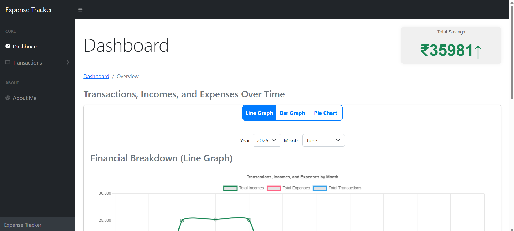
        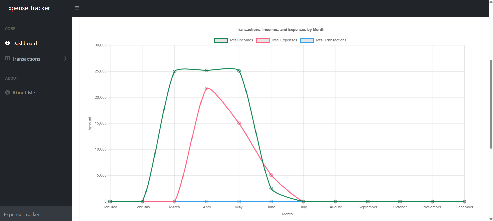
        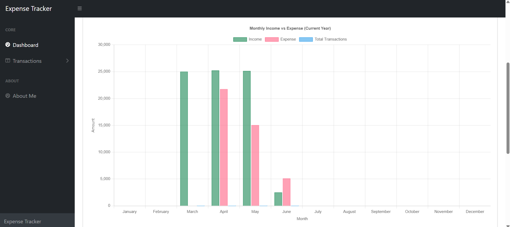
        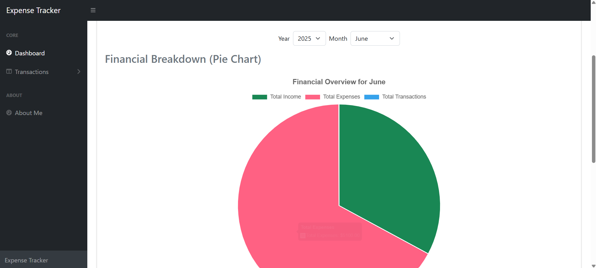
        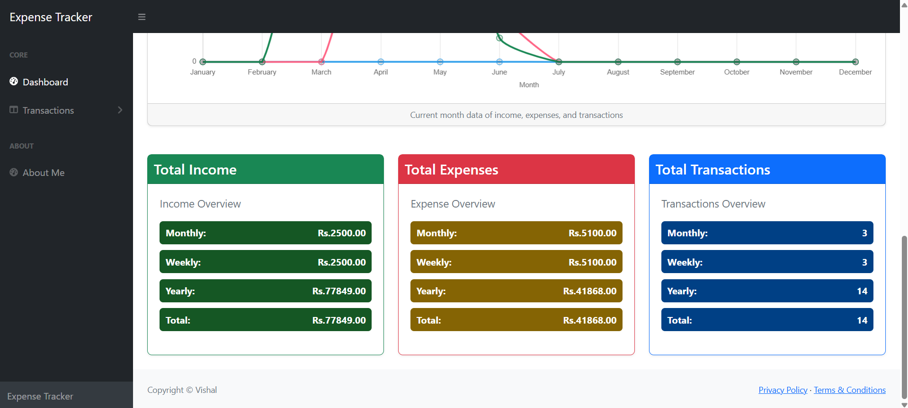
    </div>
    <div style="display: flex; grid-gap: 10px; margin:2px">
        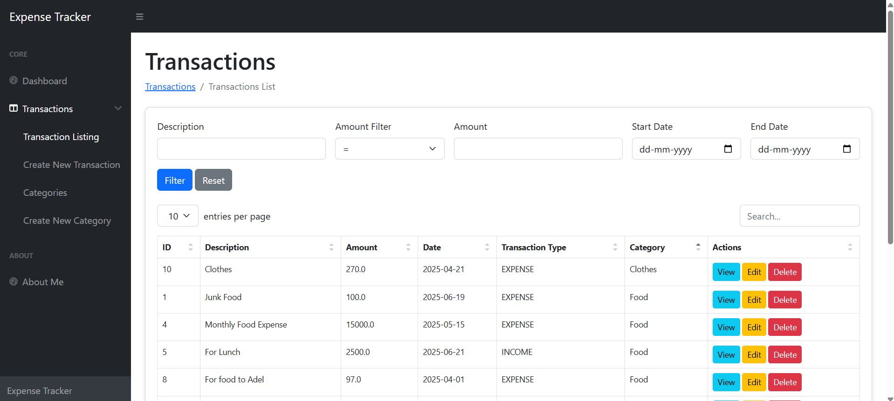
        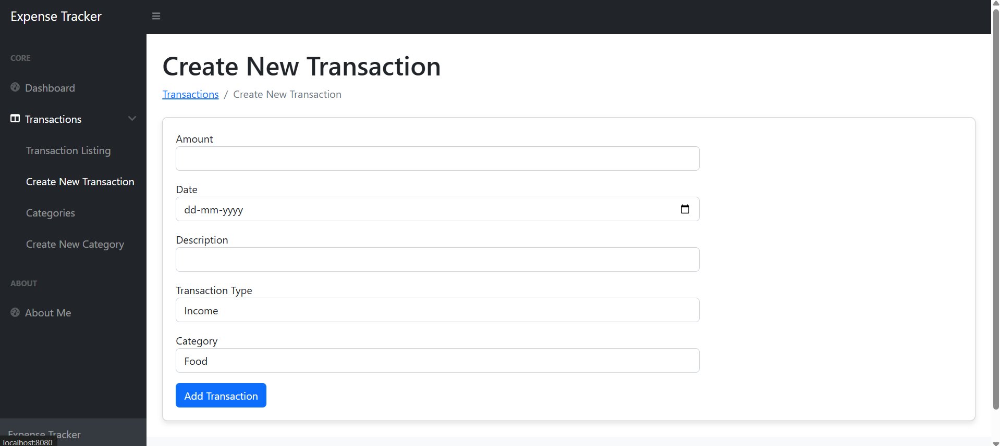
        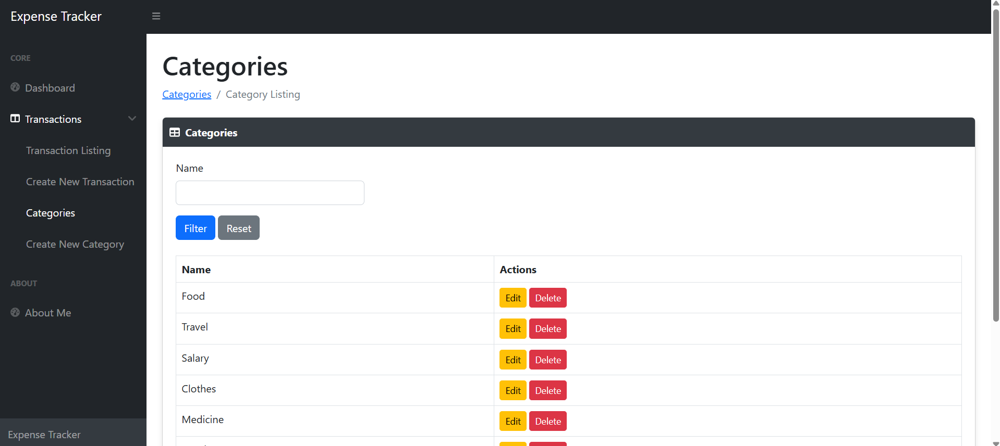
        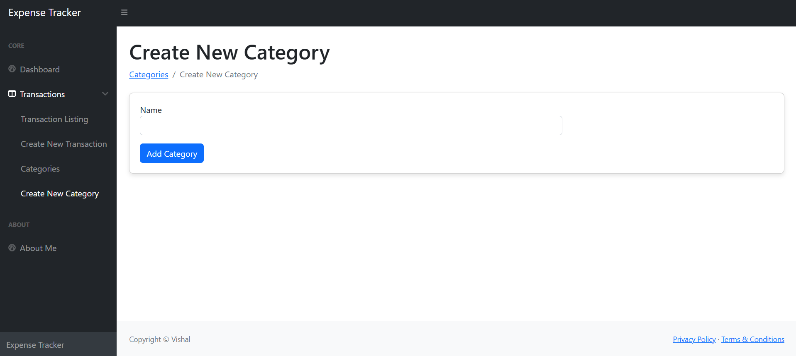
        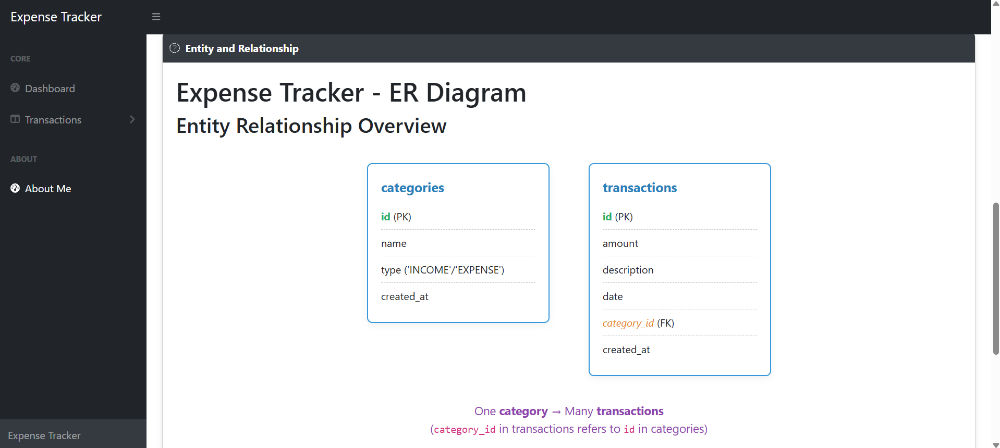
    </div>
<!--     <div style="display: flex; grid-gap: 10px;  margin:2px">
    </div> -->
</div>
<br>

## 🎥 Demo Video
[](https://github.com/vishal-1809/expense-tracker/blob/main/src/main/resources/static/assets/output/preview.mp4)


## 📌 Features

- ✍️ Add, update, and delete income and expense transactions
- 📊 Real-time graphical representation (Line, Bar, Pie) using Chart.js
- 💸 Monthly, Weekly, and Yearly financial summaries
- 📁 Category-wise transaction grouping
- 📅 Filter data by month and year
- 🔐 Backend powered by Spring Boot (REST API)
- 🗃️ Data persisted using MySQL
- 🎨 Clean and responsive UI using HTML, CSS, and JavaScript

---

## 🔧 Tech Stack

| Layer        | Technology                     |
|--------------|--------------------------------|
| Backend      | Java, Spring Boot, Spring MVC  |
| Database     | MySQL                          |
| Frontend     | HTML, CSS, JavaScript, Chart.js |
| Build Tool   | Maven                          |
| IDE          | IntelliJ / VS Code             |
| Versioning   | Git & GitHub                   |

---

## 🧠 Entity Relationship Diagram (ERD)

**Tables:**
- `transactions`  
- `categories`

**Relationships:**
- A `transaction` belongs to a `category`
- A `category` can have many `transactions`

```plaintext
categories
-----------
id (PK)
name
created_at
updated_at

transactions
-------------
id (PK)
amount
type (INCOME/EXPENSE)
date
category_id (FK)

```

## 📊 Flowchart

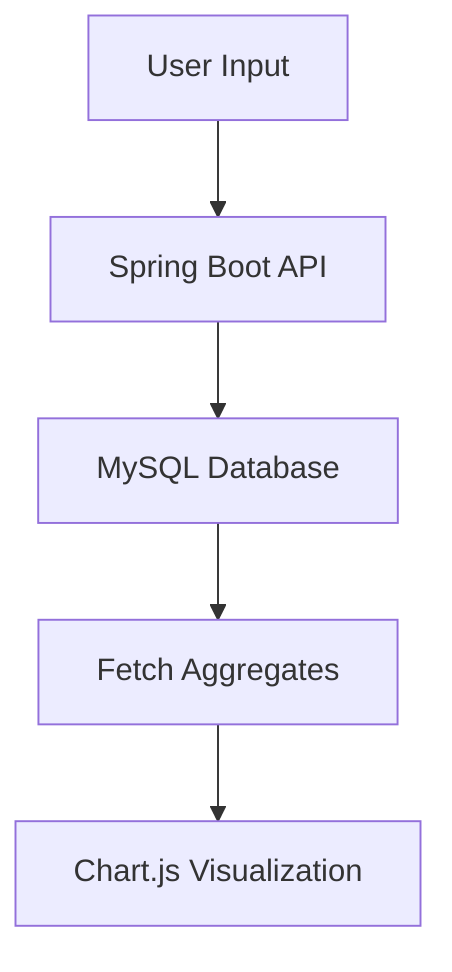
## 📦 Installation & Running

### Prerequisites

- Java 17+
- Maven or Gradle
- MySQL Server

### Steps

```bash
# Clone the repository
git clone https://github.com/vishal-1809/expense-tracker.git
cd expense-tracker

# Configure MySQL Database
# Create a database named `expensetracker_db`

# Run the application
./mvnw spring-boot:run  # or use your IDE to run the Spring Boot app

# Access it at:
http://localhost:8080


```
---
## 🔐 Environment Configuration

Update your `application.properties` file with your MySQL credentials and other required Spring Boot settings:

```properties
# Database configuration
spring.datasource.url=jdbc:mysql://localhost:3306/expensetracker_db
spring.datasource.username=your_mysql_username
spring.datasource.password=your_mysql_password


# Server port (optional)
server.port=8080


```

---

## 📫 Contact

For questions or suggestions, feel free to reach out:

- 📧 Email: 2001vishaly@gmail.com
- 💼 LinkedIn: [LinkedIn](https://www.linkedin.com/in/vishal1809/)

----
